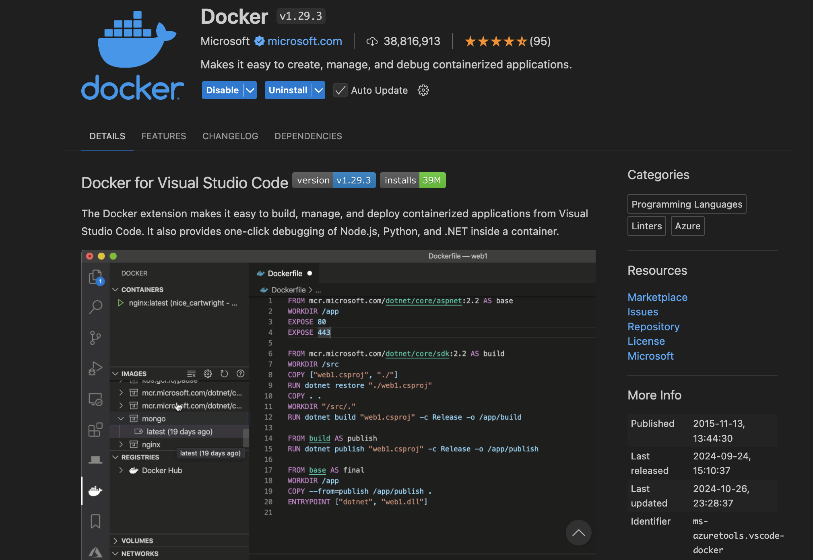

# RoomHub

## Backend Quickstart
No need to host the backend manually. It is hosted on aws lambda.
If lambda doesn't work:
1. Make sure `node` , `npm` and `java` are installed.To check:
    ```
    $ node -v
    $ npm -v
    $ java -version
    ```
    - Go to [https://nodejs.org/en/download/](https://nodejs.org/en/download/) to download the installer.
    - Go to [Java windows installation guide](https://www.youtube.com/watch?app=desktop&v=jPwrWjEwtrw) , [Java Mac installation guide](https://www.youtube.com/watch?v=PQk9O03cukQ) to install java
2. Go to the backend directory.
    ```
    $ cd Backend
    ```
3. Install dependencies.
    ```
    $ npm install
    ```
    - Update `npm` if necessary.
4. Run the server.
    ```
    $ node src/index.js
    ```

## Backend Testing
1. Make sure `node` , `npm` and `java` are installed. To check:
    ```
    $ node -v
    $ npm -v
    $ java -version
    ```
    - Go to [https://nodejs.org/en/download/](https://nodejs.org/en/download/) to download the installer.
    - Go to [Java windows installation guide](https://www.youtube.com/watch?app=desktop&v=jPwrWjEwtrw) , [Java Mac installation guide](https://www.youtube.com/watch?v=PQk9O03cukQ) to install java
2. Go to the backend directory.
    ```
    $ cd Backend
    ```
3. Install dependencies.
    ```
    $ npm install
    ```
    - Update `npm` if necessary.
4. Run all tests.
    ```
    $ npm run test
    ```
5. Run Unit tests.
   ```
   $ npm run unit-test
    ```
6. Run Integration tests.
   ```
   $ npm run integration-test
   ```

## Backend Documentation
1. Go to the backend directory.
    ```
    $ cd Backend/docs/index.html
    ```
2. Open the index.html file in Browser
3. API specification under the Namespaces group. User,Room and Notification are the current base paths we have.
4. Other documentation for classes in Modules and Classes

## Docker Quickstart

If docker doesn't work:
1. Make sure `docker`, `docker-compose` and `Docker Desktop Application` are installed. To check:
    ```
    $ docker -v
    $ docker-compose --version
    ```
    - Go to [https://docs.docker.com/desktop/](https://docs.docker.com/desktop/) to download the Docker Desktop Application based on your Operating System ('Mac', 'Windows' or 'Linux').
    - Open `EXTENSIONS` in Visual Studio Code and search for `Docker` and install this extension:
    
    You should download the correct extension as shown above.
    - Open `Terminal` in Visual Studio Code and enter this command: `sudo curl -L "https://github.com/docker/compose/releases/download/v2.21.0/docker-compose-$(uname -s)-$(uname -m)" -o /usr/local/bin/docker-compose`. You may need to replace `v2.21.0` with your current docker version by running command `docker -v` above. Then run this command: `sudo chmod +x /usr/local/bin/docker-compose`. 
    
2. Build docker: make sure you are opening Docker Desktop Application in your machine.
    ```
    $ docker compose up --build
    ```