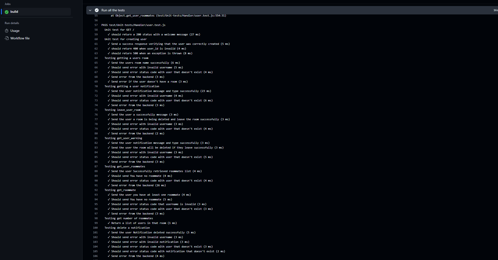

# Sprint 2 worksheet

## Regression testing
**1. How we run the regression testing**
Test Executed for Regression Testing:
  * We did add the `BE-test.yml` file in .github/workflow which will automate to run the Back end tests whenever we update some changes from Back end folder so we can ensure that when a new feature is added, a bug is fixed, or the code is refactored, regression testing re-runs previous test cases to confirm that everything stills works as expected and no new bugs have been introduced.
  * The workflow runs all backend tests automatically whenever there are changes to the `main` or `dev` branches. This includes both feature additions and bug fixes, ensuring that any new changes don't break existing functionality.
  * The command `npm run test` triggers all defined tests, including unit and integration tests, which verify core functionalities and ensure stability of the backend system.

Tool Used for Regression Testing:
  * The regression testing is automated with **GitHub Actions**, using the `BE-test.yml` workflow file. This workflow runs on a specified environment (`ubuntu-latest`), and it sets up the Node.js environment, installs dependencies, and executes the test suite on each push or pull request to key branches.
  * Node.js 22.x is specified for consistency across environments, ensuring compatibility and reducing dependency-related issues.

**2. Link to regression testing script and snapshot of execution and result of regression testing**
 * [Regression Testing script](https://github.com/WilliamOdumah/RoomHub/blob/main/.github/workflows/BE-test.yml)
 * Snapshot of execution:
 
 
 
 
 * Regression Result:
 
## Testing slowdown

## Not testing

## Profiler
#### Which endpoint is the slowest?
The slowest endpoint we have is GET task/get-completed-tasks?frm=dan@gmail.com, which took 1593.91 ms to complete.

#### Is that fixable? Why or why not?
Yes, this issue is fixable, but it involves trade-offs. This endpoint retrieves all completed tasks associated with a room and sorts them by due dates using a sorting function in the roomHandler. The sorting algorithm used has a time complexity of O(n log n), where n represents the number of tasks. This makes it slower compared to other endpoints that operate with constant time complexity or O(n).

One potential solution would be to modify our database structure. Instead of storing tasks as a list within a single table, we could store them in a separate table as individual entries. This change would allow us to leverage database querying capabilities to sort tasks by due dates directly. However, this would necessitate creating a new table, which would increase storage requirements.

Ultimately, while optimizing this endpoint is possible, we may choose not to implement the change at this time. The current performance is acceptable, as the response time is still under two seconds, and the trade-off between speed and resource utilization may not warrant the structural changes to the database.

[Profiler Log](C:\Users\DanielAF\Documents\GitHub\Comp4350\RoomHub\Backend\src\ProfilingData\profiling_results.log)

## Last dash
In the final sprint, we aim to complete the Shared Expenses and Find Roommate features, which will require significant changes to our existing database schemas. Here are some anticipated challenges:

#### 1. Database Schema Modifications:
Updating the schema will require adjustments to existing data. We’ll need to either migrate data to fit the new schema or start with a fresh database, which could disrupt current data consistency and add complexity to the deployment process.

#### 2. Frontend and Backend Integration:

With schema changes, the frontend will need updates not only for the new features but also to ensure compatibility with existing ones. This may require extensive testing and adjustments to prevent disruptions to the user experience.

#### 3.Increased Workload and Tight Deadline:
Implementing and integrating these features within the final sprint’s timeline adds a heavy workload. Given the added complexity of schema changes, there’s a risk that some functionality might not be fully completed or thoroughly tested by the sprint’s end.

#### 5.Testing and Stability:
The scope of these updates will require thorough testing across both the frontend and backend to ensure stability. The time constraints might limit our ability to identify and address all potential bugs.

## Show off
Our best work:

Aderemi-Fawoye, Daniel
 * [My best work]()

Dao, Hung Lu
 * [Deploy to Lambda](https://github.com/WilliamOdumah/RoomHub/blob/main/.github/workflows/main.yml)

Martinez Ovando, Camila
 * [My best work]()

Odumah, William
 * [My best work]()