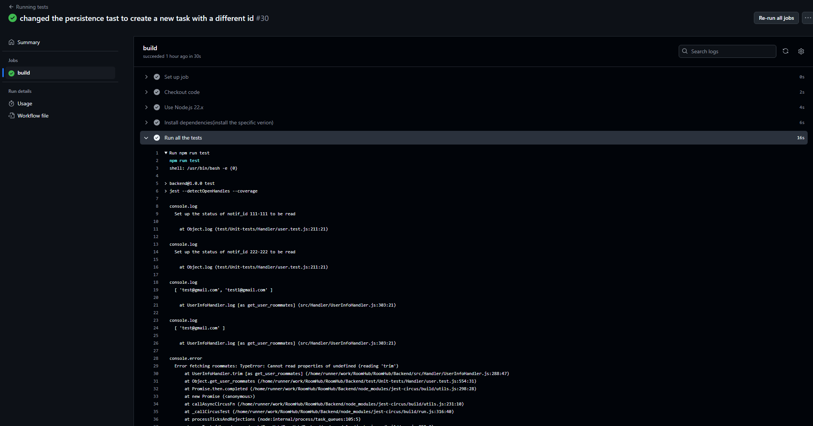
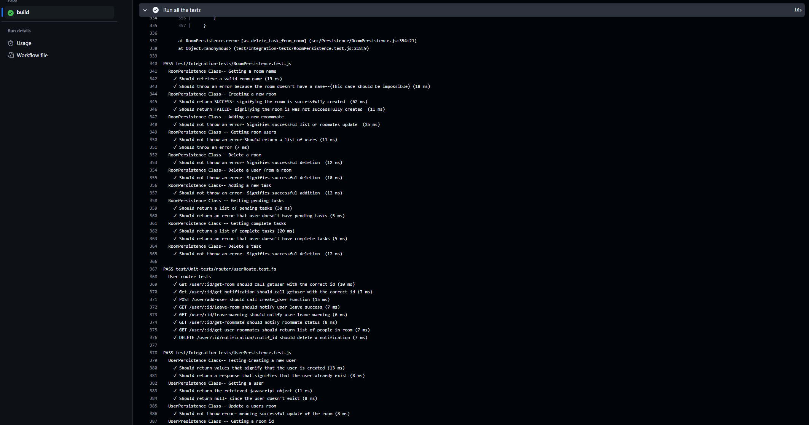
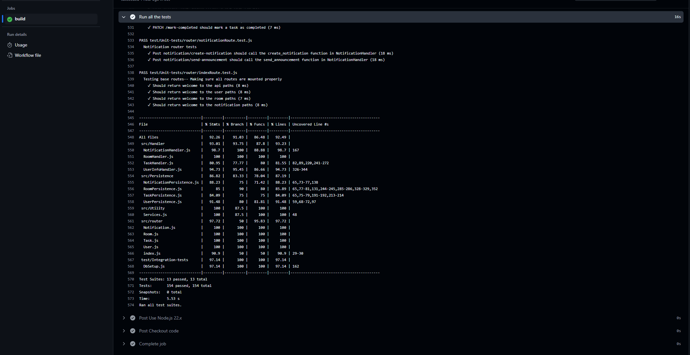

# Sprint 2 worksheet

## Regression testing
**1. How we run the regression testing**
Test Executed for Regression Testing:
  * We did add the `BE-test.yml` file in .github/workflow which will automate to run the Back end tests whenever we update some changes from Back end folder so we can ensure that when a new feature is added, a bug is fixed, or the code is refactored, regression testing re-runs previous test cases to confirm that everything stills works as expected and no new bugs have been introduced.
  * The workflow runs all backend tests automatically whenever there are changes to the `main` or `dev` branches. This includes both feature additions and bug fixes, ensuring that any new changes don't break existing functionality.
  * The command `npm run test` triggers all defined tests, including unit and integration tests, which verify core functionalities and ensure stability of the backend system.

Tool Used for Regression Testing:
  * The regression testing is automated with **GitHub Actions**, using the `BE-test.yml` workflow file. This workflow runs on a specified environment (`ubuntu-latest`), and it sets up the Node.js environment, installs dependencies, and executes the test suite on each push or pull request to key branches.
  * Node.js 22.x is specified for consistency across environments, ensuring compatibility and reducing dependency-related issues.

**2. Link to regression testing script and snapshot of execution and result of regression testing**
 * [Regression Testing script](https://github.com/WilliamOdumah/RoomHub/blob/main/.github/workflows/BE-test.yml)
 * Snapshot of execution:
 
 
 
 
 * Regression Result:
 
## Testing slowdown

## Not testing

## Profiler

## Last dash

## Show off