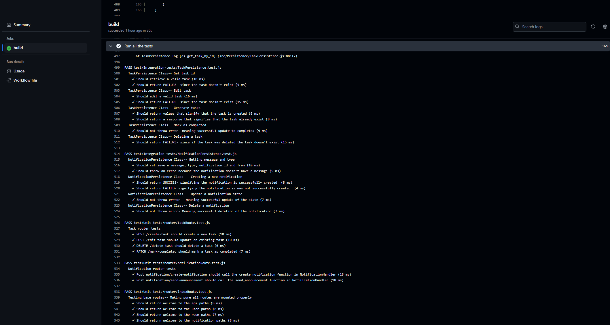

# Sprint 2 worksheet

## Regression testing
**1. How we run the regression testing**
Test Executed for Regression Testing:
  * We did add the `BE-test.yml` file in .github/workflow which will automate to run the Back end tests whenever we update some changes from Back end folder so we can ensure that when a new feature is added, a bug is fixed, or the code is refactored, regression testing re-runs previous test cases to confirm that everything stills works as expected and no new bugs have been introduced.
  * The workflow runs all backend tests automatically whenever there are changes to the `main` or `dev` branches. This includes both feature additions and bug fixes, ensuring that any new changes don't break existing functionality.
  * The command `npm run test` triggers all defined tests, including unit and integration tests, which verify core functionalities and ensure stability of the backend system.

Tool Used for Regression Testing:
  * The regression testing is automated with **GitHub Actions**, using the `BE-test.yml` workflow file. This workflow runs on a specified environment (`ubuntu-latest`), and it sets up the Node.js environment, installs dependencies, and executes the test suite on each push or pull request to key branches.
  * Node.js 22.x is specified for consistency across environments, ensuring compatibility and reducing dependency-related issues.

**2. Link to regression testing script and snapshot of execution and result of regression testing**
 * [Regression Testing script](https://github.com/WilliamOdumah/RoomHub/blob/main/.github/workflows/BE-test.yml)
 * Snapshot of execution:
 
 
 
 
 * Regression Result:
 
## Testing slowdown
### Have you been able to keep all unit tests, integration tests in your test plan? 
We kept all unit and integration tests in the test plan. Unit tests are organized into router and handler tests, with router tests using mocked handlers and handler tests mocking persistence to validate individual behaviors in isolation. 
- **Router Tests:** These include tests for user, room, notification, and task routes, ensuring that each route correctly calls the relevant handler functions.
- **Handler Tests:** These validate the logic in `UserInfoHandler`, `RoomHandler`, `NotificationHandler`, and `TaskHandler`, simulating various scenarios such as successful data retrieval, error handling, and conditionally dependent responses.
Integration tests ensure that our persistence layer operates correctly with the database:
The **UserPersistence, NotificationPersistence, RoomPersistence,** and **TaskPersistence** classes are tested to verify CRUD operations, error handling, and database consistency. For this sprint, we added the task feature, and we added specific tests for creating and retrieving tasks, updating task statuses, and handling errors in `TaskPersistence`.
### Have you created more than one test plan depending on type of release?
We perform full regression testing for release-specific testing before merging to the `dev` branch. This includes all unit and integration tests, which is feasible given the app’s small size and minimal resource demands. Running the full suite ensures stability and prevents regressions, maintaining code reliability with each update. This approach gives us confidence in the quality of each release.

## Not testing
### What have you not tested? 
In our integration tests, we couldn’t fully test some error-handling branches that depend on DynamoDB failures, these branches would trigger only if DynamoDB returned an error, which was difficult to simulate in our testing environment. For example:
- **`delete_task(task_id)`**: Similarly, this method attempts to delete a task from DynamoDB, and its `catch` block would handle any errors during the deletion process by logging and returning "FAILURE".
  
Similarly, The `index.js` router file has lower branch coverage at 50% because the condition not tested checks if the code is running on AWS Lambda. If true, it sets up the Lambda handler with awsServerlessExpress.proxy(server, event, context). This code path is only executed in production on AWS and does not run in the local environment.

### Test coverage across each tier
For our system, here's how the test coverage breaks down across each layer of each tier:
### Handler Tier
- **Fully Tested (80%+)**: 
  - All handlers (NotificationHandler, RoomHandler, TaskHandler, UserInfoHandler) are above 80% in coverage. 
  - RoomHandler is 100%, while the others range from 97.1% to 98.7% for statements, functions, and branches.

### Persistence Tier
- **Fully Tested (80%+)**: 
  - `NotificationPersistence.js`, `RoomPersistence.js`, `TaskPersistence.js`, and `UserPersistence.js` all have statement coverage between 85% and 91.5%. 
- **Mostly Tested**: 
  - Some branches and functions are less covered, especially in `NotificationPersistence` (75% branch) and `TaskPersistence`. Since required simulating DynamoDB errors, which was not feasible within our current integration testing setup. 

### Utility Tier
- **Fully Tested (80%+)**: 
  - `Services.js` has 100% for statements and functions, with branch coverage at 87.5%. 

### Router Tier
- **Fully Tested (80%+)**: 
  - All routers (Notification, Room, Task, User, index) have high coverage, with each above 90% for statements and functions. 
  - The `index.js` router has lower branch coverage because the branch is entered only if the code is running on AWS Lambda, but still meets the criteria for "fully tested" in statements and function coverage.

### Integration Tests Tier
- **Fully Tested (80%+)**: 
  - `DbSetup.js` in our integration tests is 97.1% covered.

## Profiler

## Last dash

## Show off
Our best work:

Aderemi-Fawoye, Daniel
 * [My best work]()

Dao, Hung Lu
 * [Deploy to Lambda](https://github.com/WilliamOdumah/RoomHub/blob/main/.github/workflows/main.yml)

Martinez Ovando, Camila
 * [Handler for the task organization feature](https://github.com/WilliamOdumah/RoomHub/blob/main/Backend/src/Handler/TaskHandler.js)

Odumah, William
 * [Designing and implementing the functionality of the tasks page](https://github.com/WilliamOdumah/RoomHub/blob/main/Frontend/src/pages/ManageTasksPage.js)
